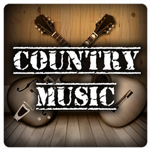

Influence on Culture
====================

Country music has influenced a modern generation of *cowboy's*.
The popularity and influence of country has been carried on by 
generations of people who appreciate the twang and relate it to 
themselves. Traditionally country music has it's roots tied to the 
blue collar type of listener. This has helped influence a culture 
of blue collar cowboy types. That is those who work in industries or
careers that require work, and the type of music reflecting and connecting
well with those listeners. Country music influenced the culture of the cowboy as well.
The marketability is what drives trends in country. For instance, country music
originally had nothing to do with wearing cowboy boots or farm work, but over years
of cultural influence, Nashville has grown into the empire that it is today.

The country music empire is also ever changing. What was originally music with
roots found in bluegrass and soul music has expanded into a pop and rock and roll
type feel. As country music evolves, we see more and more artist that deviate from what
is considered a traditional country singer. Artists like Florida Georgia Line represent what the 
new era of country is with their renditions of a country pop like musical approach. Meanwhile artists
such as Chris Stapleton and Sturgil Simpson represent a form of country going back to it's roots with their 
soulfull takes on country music.

