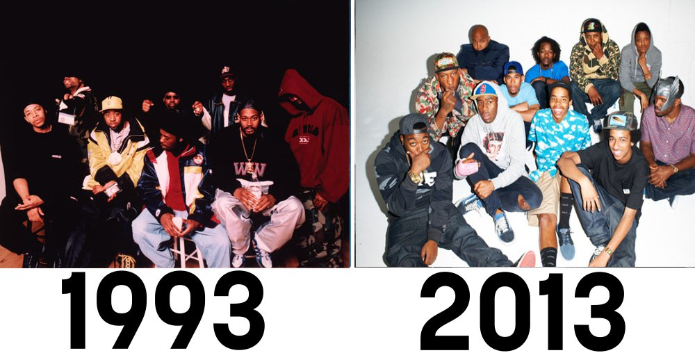

Hip-Hop's Influence on Culture
==============================

Hip Hop as a genre for better or for worse has had a major impact on the 
music industry and American culture as a whole. Hip Hop is an uplifting genre 
meant to bring a voice to the people who feel like they have none. The major 
opponents of hip hop believe the music is aggressive and has a rebellious 
behavior. Whether this genre is negative or not, the genre is a platform and 
vocal outlet for people in America. It has allowed rappers to express their 
thoughts and opinions on the current state of society. Hip-Hop represents 
marginalized groups who have been taken advantage of by the government. 

Hip-Hop in the 20th Century 
----------------------------

Hip-Hop during the nineties greatly evolved and acted in direct retaliation 
against the socio-economic issues of the time, which impacted social culture 
and social changes in American history. Hip-Hop allowed marginalized groups to 
fight injustices against them through music as a form of protest.  Hip-Hop in 
the nineties marked a national movement to uplift people across the nation, 
which holds major social and cultural significance. Hip Hop acted as a voice for 
many marginalized Americans, which built up the ideals and identities of entire 
communities. In fact, many of the MC’s in the nineties like Tupac and Snoop Dogg 
represented the voices of an entire generation. 

To find out more on hip-hop's influnce on culture. Checkout this 
`Spinditty article`_. The image was found on a website called `itzarap`_.

.. _Spinditty article: https://spinditty.com/genres/Hip-Hops-Influence-on-America
.. _itzarap: https://itzarap.wordpress.com/2013/05/15/hip-hop-and-youth-culture-in-todays-society/